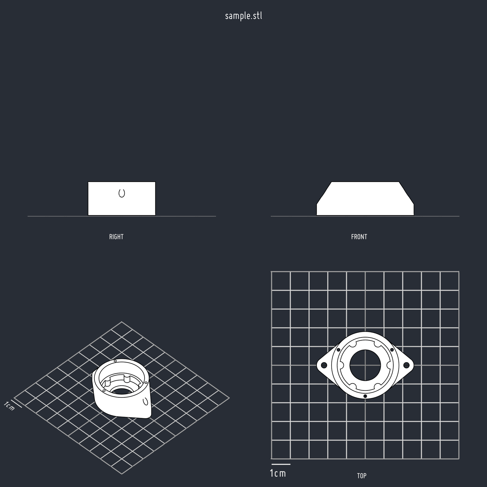

# headless blender script to generate shadeless freestyle render
A scene I use to render STL files.

forked from https://github.com/pauls-3d-things/blender-stl-render-scene

There is a scene for larger objects `render-20x20.blend`, and one for smaller object `render-10x10.blend`.




## How to use

**Please use Blender > 2.80**
```
blender render-10x10.blend --background --python-text render-pipeline.py -- sample.stl
```

The images will be saved in the current directory.

## Font License

Please see [http://martennettelbladt.se/miso/](http://martennettelbladt.se/miso/) for the embedded fonts license (`miso.otf`)
